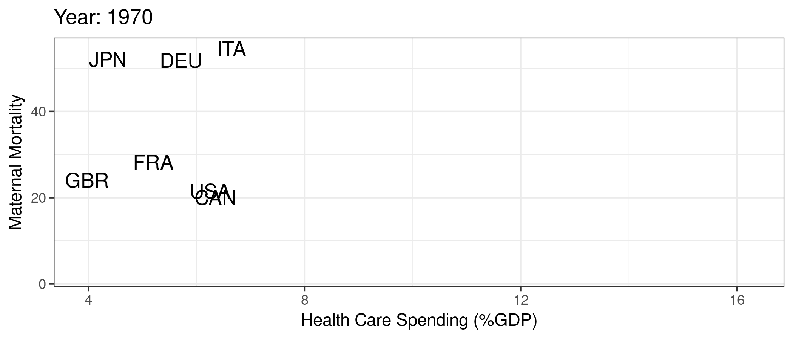
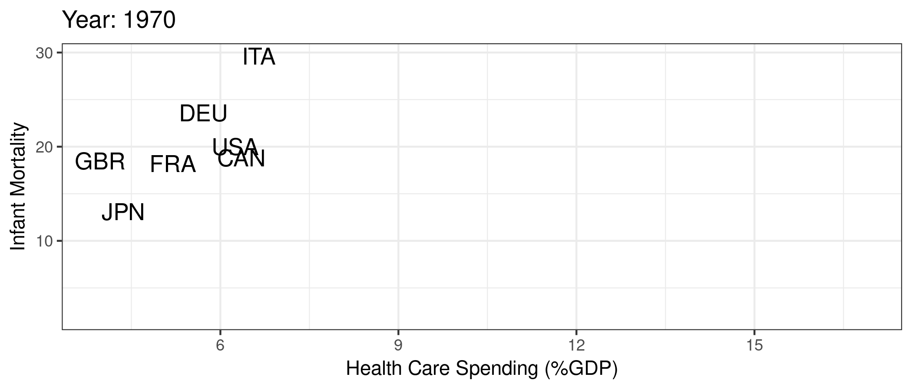

## Welcome {.unnumbered}

Health care is a vital component of our society, and it is essential to understand the economic principles that underlie this complex system. Health care economics is the study of how resources are allocated to produce, distribute, and consume health care goods and services. It encompasses a wide range of topics, including the behavior of health care providers, the role of insurance and government policy, and the impact of health care on the economy as a whole.

This book is intended to offer an introduction to the study of health care economics. It covers key topics such as health insurance and health care financing, physician behaviors, physician and hospital pricing, and prescription drug markets. Within each topic, we will work through specific theoretical models and discuss current health policy in the context of those models. 

From this book, readers should be able to:

1. Explain the structure of the U.S. health care system, its main components, and its history
2. Model adverse selection in health insurance, examine its effects on health insurance markets, and support your arguments with existing data
3. Explain the physician agency problem, use a model of physician agency to examine financial incentives in health care, and summarize empirical evidence on the presence of physician agency
4. Describe hospital pricing, negotiation with insurers, and explain (qualitatively and quantitatively) the differences between charges and prices
5. Analyze hospital data in a real-life setting and predict effects of real-life policies


## Health Improvements

```{r}
#| include: false
if (!require("pacman")) install.packages("pacman")
pacman::p_load(tidyverse, ggplot2, gganimate, gapminder, scales, hrbrthemes, OECD, here)
```

@fig-life-exp presents the median life expectancy across the world from around 1950 to 2010. As made clear from @fig-life-exp, the world has witnessed significant progress in improving life expectancy over the past several decades. This progress can be attributed to several factors, including poverty reduction, technological advancements, and increased access to critical needs, including basic healthcare. As a result, people are living longer and generally healthier lives, with fewer deaths from infectious diseases and a higher quality of life in general. 

```{r}
#| echo: false
#| fig.cap: "Median life expectancy across the world"
#| label: fig-life-exp
library(gapminder)
gapminder %>%
  group_by(year) %>%
  summarize(lifeExp = median(lifeExp),
            gdpMed = median(gdpPercap)) %>%
  ggplot(aes(year,lifeExp)) + geom_line(alpha = 1/3) + theme_bw() +
    labs(x = "Year",
         y = "Life Expectancy (years)")
```


## Health and Wealth

Not surprisingly, gains in health are correlated with economic growth and development, as illustrated in @fig-life-exp-gdp.

```{r}
#| echo: false
#| fig.cap: "Life expectancy and GDP"
#| label: fig-life-exp-gdp
library(gapminder)
ggplot(data = gapminder, mapping = aes(x = gdpPercap, y = lifeExp)) + 
  geom_point(size = 1) + theme_bw() + scale_x_continuous(label = comma) +
  labs(x = "GDP Per Capita ($US)",
       y = "Life Expectancy (years)")
```


This relationship between wealth and health is even more evident when we look over time by country, as demonstrated in @fig-anim-lifegdp. This makes sense if we think of ways to improve very low life expectancy (e.g., life expectancy cut due to lack of basic necessities like food, shelter, clean water, basic medicine, etc.). 

```{r}
#| message: false
#| warning: false
#| echo: false
#| fig.cap: "Life expectancy and GDP by country"
#| label: fig-anim-lifegdp

 ggplot(gapminder, aes(gdpPercap, lifeExp, size = pop)) +
  geom_point(alpha = 0.5, show.legend = FALSE) +
  scale_colour_manual(values = country_colors) +
  scale_size(range = c(2, 12)) +
  scale_x_log10() +
  facet_wrap(~continent) +
  labs(title = 'Year: {frame_time}', x = 'Log GDP Per Capita ($US)', y = 'Life Expectancy (years)') +
  transition_time(year) +
  ease_aes('linear')
```

But conditional on a relatively high life expectancy, the link between economic performance and life expectancy isn't so clear. The U.S. is a good example. In @fig-anim-country, we focus specifically on G7 countries and highlight the U.S., where we see that the U.S. life expectancy begins to flatten while health care expenditures far outgrow those of other countries.

```{r}
#| message: false
#| warning: false
#| echo: false
#| fig.cap: "Life expectancy and GDP by country"
#| label: fig-anim-country
mycolors <- c("US" = "red", "other" = "grey50")
gapminder %>% filter(country %in% c("Canada", "France", "Germany", "Italy", "Japan", "United Kingdom", "United States")) %>%
  mutate(highlight = ifelse(country=="United States", "US", "other")) %>%
  ggplot(aes(gdpPercap, lifeExp, size = pop)) +
  geom_point(alpha = 0.5, show.legend = FALSE, aes(color=highlight)) +
  scale_color_manual("U.S.", values = mycolors) +
  scale_size(range = c(2, 12)) +
  scale_x_comma(limits=c(0,55000)) + 
  labs(title = 'Year: {frame_time}', x = 'GDP Per Capita ($US)', y = 'Life Expectancy (years)') +
  transition_time(year) +
  ease_aes('linear')
```


## Health Care Spending and Outcomes

Of course, life expectancy is heavily influenced by things like car accidents, guns, and other policy issues that are not necessarily "health care" related. As such, life expectancy is likely a poor measure of the quality of a country's health care system. Still, despite significanly larger health care expenditures, the U.S. continues to underperform in more direct health care outcomes, like maternal mortality and infant mortality presented in @fig-mort.


::: {#fig-mort layout-ncol=2}

{#fig-maternal}

{#fig-infant}

Maternal and infant mortality by country
:::

Unfortunately, infant and maternal mortality are not the only measures by which the U.S. health care system appears to be underperforming. @commonwealth2019 provides a broader analysis of the U.S. health care system in comparison to other high-income countries. The 2019 report (i.e., pre-Covid) highlights significant gaps in health outcomes, access, and affordability in the U.S. compared to other countries. Specifically, the U.S. ranks last among the 11 high-income countries analyzed in terms of health outcomes, with higher rates of mortality and morbidity from chronic diseases, such as heart disease, diabetes, and cancer. Additionally, the U.S. has the highest rate of mortality amenable to health care, suggesting that the health care system is not functioning optimally. The report also finds that the U.S. has the highest rate of adults who go without needed health care due to cost, with one-third of adults reporting cost-related access problems.

That said, it is important to also note that the U.S. health care system ranks among the best in the world in several key areas. One area in which the U.S. excels is in the provision of specialized care, particularly in the fields of cancer, heart disease, and stroke. The U.S. has some of the highest survival rates for certain types of cancer, such as breast and prostate cancer, and is a leader in the development and use of advanced medical technologies, such as MRI and CT scans. The U.S. also has some of the highest rates of bypass surgery and angioplasty for heart disease, which can be life-saving interventions.

Another area of high-quality care in the U.S. is in the field of medical research and innovation. The U.S. is home to many of the world's top medical research institutions and is a leader in the development of new drugs and medical devices. This innovation has led to significant advances in the treatment of many diseases and has improved the quality of life for millions of people.

This dichotomy of very good health care in some areas along side very poor health care in other areas is reflective of what many believe to be the true underlying problem with the U.S. health care system--access to care. In many ways, we "overprovide" care to some people and underprovide care to lots of other people. We are particularly bad at helping the least healthy among us. These issues are, of course, very closely related to other economic problems and inequality in general.


## Why Study the Economics of Health Care

Health care is a unique industry that presents several key economic challenges, including adverse selection and asymmetric information between patients and physicians, as well as between patients and insurers. Adverse selection occurs when patients with higher health care needs are more likely to purchase insurance, leading to higher costs for insurers and making it more difficult for insurers to design effective insurance products. Insurers may have limited information about patients' health status and risk, which can exacerbate adverse selection. 

Patients often lack the knowledge and expertise to make informed decisions about their health care, while physicians may have incentives to recommend more expensive treatments. This can lead to overutilization of health care services and higher costs for patients and insurers. Additionally, patients may not have access to all of the relevant information about their health care options, which can make it difficult for them to make informed decisions about their care. These information asymmetries can make it challenging to align incentives between patients and physicians and can lead to inefficiencies in the market.

Health care also presents challenges due to unpredictable need and product heterogeneity. Patients may require different types and levels of care depending on their individual health needs, making it difficult to standardize health care products and services. This can make it challenging for patients to shop around for health care services and can lead to inefficiencies in the market. 

## Why is the US so different?

The challenges of adverse selection, asymmetric information, unpredictable need, and product heterogeneity are particularly salient in a market-based health care system such as that of the United States. For example, insurers and providers may exploit market power in their pricing and treatment decisions, which can lead to underinvestment in preventive care and overutilization of high-cost services. Additionally, our market-based system can exacerbate information asymmetries, as patients may not have access to all of the relevant information about their health care options. This can make it challenging for patients to make informed decisions about their care, encouraging selection of more expensive providers and ultimately contributing to overutilization of health care services and higher costs. 

Perhaps most importantly, our market-based system introduces a significant amount of fragmentation. We have several different ways to receive insurance, meaning that health care providers must manage payments and negotiate contracts from a variety of different payors. We also have several different types of providers, including "standard" acute care inpatient hospitals, stand-alone surgery centers, long-term care hospitals, outpatient facilities, physicians and physician offices, urgent care centers, emergency departments, independent ambulance companies, home health agencies, nursing home companies, and others. As health care becomes more complicated and specialized, complications from the interaction of all of these fragmented providers and payors will tend to be exacerbated. For the most part, this fragmentation tends to push up prices and may also reduce the quality of care, particularly for patients with chronic diseases needing coordinated care over a long time period.

Overall, these challenges highlight the need for innovative solutions to address the inefficiencies of the U.S. health care system and improve health outcomes for all Americans.


## Supplemental Resources

- Readers can access the supplemental class slides for this material [here](index-slides.html).