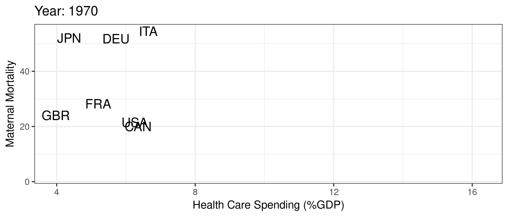
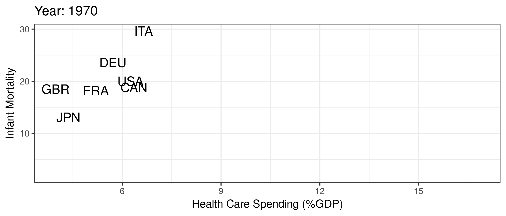

# Introduction {.unnumbered}

## Health Improvements

```{r}
#| include: false
if (!require("pacman")) install.packages("pacman")
pacman::p_load(tidyverse, ggplot2, gganimate, scales, hrbrthemes, OECD, here, png, gifski)

# World Bank life expectancy, GDP per capita (PPP, constant $), and population,
# 1960-2024; pulled by data/worldbank/pull_wb.py. Same file the slides use.
wb <- read_csv("data/worldbank/wb_health_wealth.txt", show_col_types = FALSE) %>%
  mutate(region = str_trim(region),
         region = recode(region,
                         "Latin America & Caribbean" = "Latin America",
                         "Middle East, North Africa, Afghanistan & Pakistan" = "Middle East & N. Africa",
                         "Europe & Central Asia" = "Europe & C. Asia"))
```

Since 1960, global life expectancy has risen dramatically, driven by poverty reduction, public health advances, and wider access to basic care. People live longer, healthier lives, with fewer deaths from infectious disease and better quality of life overall (@fig-life-exp).

```{r}
#| echo: false
#| fig.cap: "Median life expectancy across the world"
#| label: fig-life-exp
wb %>%
  filter(!is.na(life_exp)) %>%
  group_by(year) %>%
  summarize(life_exp = median(life_exp)) %>%
  ggplot(aes(year, life_exp)) + geom_line(alpha = 1/3) + theme_bw() +
    labs(x = "Year",
         y = "Life Expectancy (years)")
```


## Health and Wealth

These health gains have moved hand-in-hand with economic growth. Higher incomes allow countries to invest in food, clean water, shelter, and medical care, all of which extend life expectancy (@fig-life-exp-gdp). 

```{r}
#| echo: false
#| fig.cap: "Life expectancy and GDP"
#| label: fig-life-exp-gdp
wb %>%
  filter(!is.na(gdp_pc), !is.na(life_exp)) %>%
  ggplot(aes(x = gdp_pc, y = life_exp)) +
  geom_point(size = 1) + theme_bw() + scale_x_continuous(label = comma) +
  labs(x = "GDP per capita (PPP $)",
       y = "Life Expectancy (years)")
```


This relationship between wealth and health is even more evident when we look over time by country, as demonstrated in @fig-anim-lifegdp. This makes sense if we think of ways to improve very low life expectancy (e.g., life expectancy cut due to lack of basic necessities like food, shelter, clean water, basic medicine, etc.). 

```{r}
#| message: false
#| warning: false
#| echo: false
#| fig.cap: "Life expectancy and GDP by country"
#| label: fig-anim-lifegdp

wb %>%
  filter(!is.na(gdp_pc), !is.na(life_exp), !is.na(pop)) %>%
  ggplot(aes(gdp_pc, life_exp, size = pop)) +
  geom_point(alpha = 0.5, show.legend = FALSE) +
  scale_size(range = c(2, 12)) +
  scale_x_log10(label = comma) +
  facet_wrap(~region) +
  labs(title = 'Year: {round(frame_time)}', x = 'GDP per capita (PPP $, log scale)', y = 'Life Expectancy (years)') +
  transition_time(year) +
  ease_aes('linear')
```

Yet this relationship weakens once countries reach higher levels of health. For example, among the G7, U.S. life expectancy has stagnated even as U.S. GDP per capita has outpaced peers (@fig-anim-country).

```{r}
#| message: false
#| warning: false
#| echo: false
#| fig.cap: "Life expectancy and GDP by country"
#| label: fig-anim-country
mycolors <- c("US" = "red", "other" = "grey50")
wb %>%
  filter(country %in% c("Canada", "France", "Germany", "Italy", "Japan", "United Kingdom", "United States"),
         !is.na(gdp_pc), !is.na(life_exp)) %>%
  mutate(highlight = ifelse(country == "United States", "US", "other")) %>%
  ggplot(aes(gdp_pc, life_exp, size = pop)) +
  geom_point(alpha = 0.5, show.legend = FALSE, aes(color = highlight)) +
  scale_color_manual("U.S.", values = mycolors) +
  scale_size(range = c(2, 12)) +
  scale_x_comma(limits = c(30000, 80000)) +
  labs(title = 'Year: {round(frame_time)}', x = 'GDP per capita (PPP $)', y = 'Life Expectancy (years)') +
  transition_time(year) +
  ease_aes('linear')
```


## Health Care Spending and Outcomes

If income is not the whole story, perhaps health care spending is. The U.S. spends far more on health care than peer nations, yet performs worse on outcomes such as infant and maternal mortality (@fig-mort). Since the mid-1980s, U.S. health spending has accelerated while these outcomes have worsened.

::: {#fig-mort layout-ncol=2}

{#fig-maternal}

{#fig-infant}

Maternal and infant mortality by country
:::

Unfortunately, infant and maternal mortality are not the only measures by which the U.S. health care system appears to be underperforming. Commonwealth's 2019 report on health care systems around the world (i.e., pre-Covid) highlights significant gaps in health outcomes, access, and affordability in the U.S. compared to other countries. Specifically, the U.S. performs worst among the 11 high-income countries analyzed in terms of health outcomes, with higher rates of mortality and morbidity from chronic diseases, such as heart disease, diabetes, and cancer. Additionally, the U.S. has the highest rate of mortality amenable to health care, suggesting that the health care system is not functioning optimally. The report also finds that the U.S. has the highest rate of adults who go without needed health care due to cost, with one-third of adults reporting cost-related access problems.

Still, the U.S. excels in certain areas: cancer survival, treatment of cardiovascular disease, and medical innovation. Our system is capable of world-leading care, but it delivers it unevenly. The coexistence of excellence and underperformance reflects deep inequities in access and use of care.


## Why Study the Economics of Health Care?

Economics helps explain this paradox. Health care markets differ from textbook markets in at least six ways.

1. **Extremely heterogeneous products.** The same patient with the same knee image can be told to have the knee replaced, to have an injection, or to do physical therapy. What is being bought is a recommendation as much as a procedure, and it varies with who is asked. T. R. Reid's *The Healing of America* takes one bad shoulder to physicians in several countries and finds them differing on whether to operate at all.
2. **Asymmetric information between patients and physicians.** The physician knows far more about what the patient needs than the patient does, and is also the one selling the treatment. The chapters on physicians are largely about what follows from that.
3. **Unobservable quality.** In most markets you learn the quality of a product by using it. Health care is not even that kind of good. A patient who has a difficult delivery, a complication, and a few days of monitoring for the baby, and comes home with everyone healthy, will reasonably describe it as the best care she has ever received, with no way to know whether a different set of decisions along the way would have made the whole episode unnecessary.
4. **Unpredictable need.** A large share of care is needed suddenly, and there is no time to compare when it is. Even care that can be planned is hard to shop for, because the patient often does not know what is being bought until it has been bought.
5. **Insurance distorts incentives.** Once a patient's deductible is met, most of the bill is someone else's, so every provider costs the patient roughly the same and there is little reason to compare prices. This is a description of why the usual pressure on prices is weak in this market rather than a case for making patients pay more.
6. **Adverse selection.** The people most willing to pay for insurance are the ones who expect to use it most. The cost of providing the product therefore depends on who buys it, which is not true of a computer or a car, and an insurer that raises its price to cover the sick loses the healthy customers it needs to keep the price down. The chapters on insurance markets are about this problem.

These features exist in other markets and in other countries. What makes health care unusual is that all six are present at once, and what makes the U.S. unusual is how far each one is allowed to run, which is largely a matter of policy.

## Why is the U.S. so Different?

The obvious question is why the U.S. spends so much more than other high-income countries for outcomes that are, at best, uneven. The same handful of explanations comes up whenever the question is asked, and each contains some truth. None of them carries much weight on its own.

- **Americans are less healthy.** The U.S. has higher rates of obesity and cardiovascular disease than most peer countries, but Americans also smoke and drink considerably less. Health status differs across countries in both directions, and those differences do not come close to explaining the gap in spending.
- **Americans use more care.** Utilization is hard to compare across the board, and where it can be compared the U.S. is not uniformly the heaviest user. Japan, for example, has about half again as many MRI scanners per person as the U.S. The U.S. does use more of some intensive services, but overall utilization does not explain the gap.
- **Physicians are paid too much.** U.S. physicians are well paid, but so are U.S. professionals generally. The premium physicians earn over other high-paying careers looks broadly similar in the U.S. and in other developed countries, so physician pay does not explain the difference between countries.
- **Fraud.** Fraud is real. Recent settlements over upcoding in Medicare Advantage have run to hundreds of millions of dollars. But fraud is a small share of total spending. It exists, but it is not why the U.S. spends what it spends.
- **Administrative waste.** This one is real and large. Every provider deals at once with Medicare, Medicaid, Medicare Advantage plans, Medicaid managed care plans, and many private insurers, each with its own rules about what is covered, what needs prior authorization, and how a claim must be submitted. Knowing those rules, submitting the paperwork, and resubmitting it when it comes back rejected takes a lot of people.
- **Defensive medicine and malpractice.** The argument that fear of lawsuits leads physicians to order tests they would not otherwise order was especially popular in the 1990s, and many states adopted tort reforms in the years since, some strict enough to cap legitimate claims. The estimated effects of those reforms on spending have been small. Defensive medicine is a real cost of practicing under legal exposure, but it is not why the U.S. spends what it does.

The explanation that survives is prices. For the same procedure, the same drug, or the same day in the hospital, the U.S. pays far more than other countries. @anderson2003 made this argument in an article titled "It's the Prices, Stupid," and a 2019 follow-up in the same journal, "It's Still the Prices, Stupid," reached the same conclusion with updated data. If those prices bought the best care in the world, that would be a defensible trade. As the mortality figures above show, they do not, at least not across the board.

Prices are the headline rather than the whole story, because a price is the outcome of everything underneath it. The U.S. system is market-based and fragmented. Patients face dozens of insurance options; providers range from hospitals to surgery centers to urgent care clinics; each negotiates and bills separately. Fragmentation drives up costs and undermines coordination, especially for chronic illness. Information problems, bargaining between insurers and providers, and policy choices all feed into what care costs, and a large part of this book is about how. If the answer were any one of these things, it would have been fixed by now. It is a combination of many things that interact, which is what makes the problem hard, and what makes it an economics problem.

The result is a system that spends more, delivers uneven outcomes, and leaves access gaps that other high-income countries have solved more effectively. Understanding the economics behind these failures—and the successes—provides the foundation for designing better policies.

