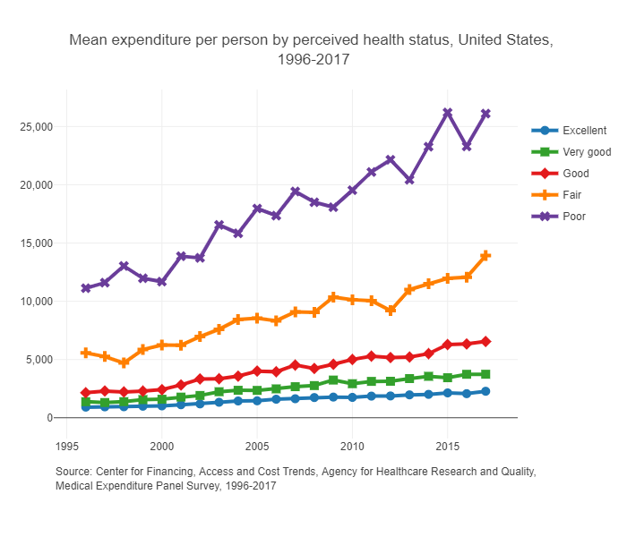

# Health Insurance

In 2018, Humana withdrew from the ACA exchanges citing an "unbalanced risk pool" due to the results of the 2017 open enrollment period. The risk pool refers to the collection of policyholders and their corresponding risk levels. In this context, Humana essentially claimed that their enrollees were too sick and too expensive relative to the plan premiums. 

---

## Managing Risk is Really Important

This section emphasizes the importance of managing risk for insurance companies. Two graphs are displayed, which show the relationship between health expenditures and health conditions. Insurers need to be aware of their customers' health conditions to manage their risk pool properly. The risk pool refers to the collection of policyholders and their corresponding risk levels. The graphs are sourced from the

{#fig-meps-spend}

