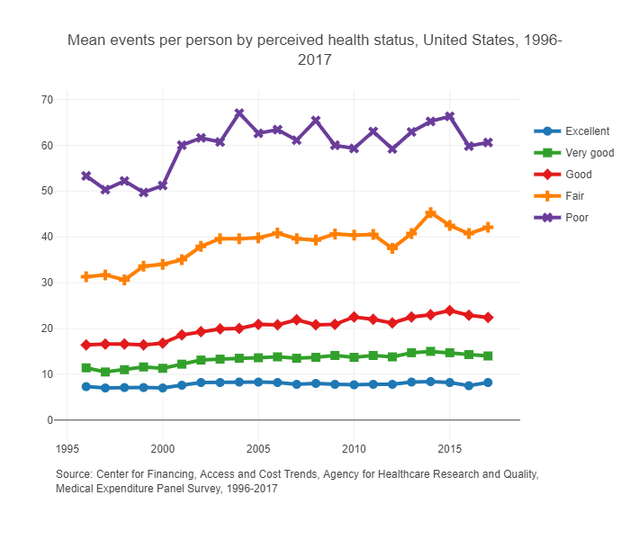

Section I of the book covers health insurance. First, we discuss the basics of a health insurance product or contract --- kind of a primer on how insurance works in the U.S. from a patient's perspective, and how people receive health insurance in the U.S. This is the subject of Chapters 1 and 2. We then get into the economic theory of why people buy health insurance, particularly how individual health status and risk preferences affect the willingness to pay for health insurance. This is the subject of Chapters 3 and 4 (Buying Insurance). We then move from an individual's insurance decision to the market, focusing on the problem of adverse selection and its implications for premiums and insurance coverage. This is the subject of Chapters 5 and 6 (Insurance Markets). Finally, I conclude Section I of the book with a discussion of current health insurance policy in the U.S. and a brief collection of important health insurance terminology.

## Motivation

Let's motivate our study of health insurance with a simple story of Humana and the ACA exchanges. In 2018, [Humana withdrew from the ACA exchanges](https://money.cnn.com/2017/02/14/news/economy/humana-obamacare-insurer) citing an "unbalanced risk pool" due to the results of the 2017 open enrollment period. The risk pool refers to the collection of policyholders and their corresponding risk levels. In this context, Humana essentially claimed that their enrollees were too sick and too expensive relative to the plan premiums. Humana had also just had their proposed merger with Aetna blocked by the Department of Justice (details [here](https://www.npr.org/sections/thetwo-way/2017/02/14/515167491/aetna-and-humana-call-off-merger-after-court-decision)), which may have also been related to the decision to drop out of the ACA exchanges.

Managing the risk pool is critical for insurers (not just health insurers). One reason that this is so important is because of something called ["community rating"](https://www.healthcare.gov/glossary/community-rating/) which sets restrictions on how much insurers can change premiums for different enrollees in the same market. While there is some opportunity to charge some enrollees different premiums, it's useful just to think of community rating as requiring all enrollees in a given market to be charged with the same premium. So, since insurers can't ask some people to pay more than others, they have to set their premiums so that the revenue collected from the very healthy enrollees (those that don't use much health care) offsets any losses paid out to providers for very unhealthy enrollees (those that use lots of health care, or those that are just very unlucky in a given year). If an insurer underestimates the share of high-need patients enrolling in a plan, then they will have an "unbalanced risk pool" and incur more expenses than expected, potentially to the point of eroding any profits from the low-need enrollees.

@fig-meps highlights the relationship between health care utilization and patients' underlying health status, where we see that those self-reported to be of low health also have the highest health care expenditures and most frequent encounters with the health care system. As is clear from these figures, insurers can expect to incur more costs as less healthy patients enroll in their plans.

::: {#fig-meps layout-ncol=2}

{#fig-meps-spend}

{#fig-meps-visits}

Health care expenditures and encounters by health status
:::

## Supplemental Resources

- Readers can access the supplemental class slides for this material [here](supp/index-slides.html).

## Bibliography

