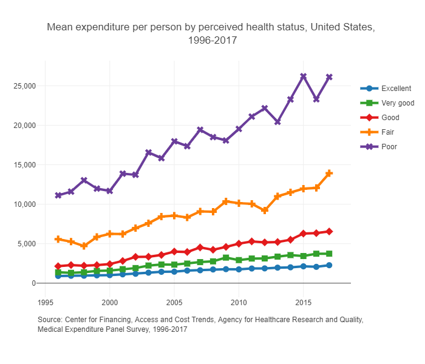
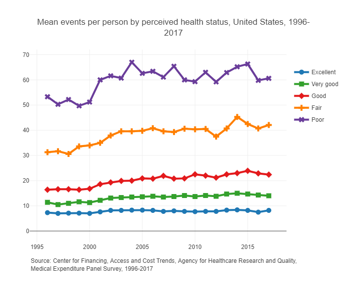

```{r}
#| include: false
if (!require("pacman")) install.packages("pacman")
pacman::p_load(tidyverse, ggplot2, gganimate, gapminder, scales, hrbrthemes, OECD, here, png, gifski, magick, pdftools)
```


Let's motivate some of this with a simple story of Humana and the ACA exchanges. In 2018, [Humana withdrew from the ACA exchanges](https://money.cnn.com/2017/02/14/news/economy/humana-obamacare-insurer) citing an "unbalanced risk pool" due to the results of the 2017 open enrollment period. The risk pool refers to the collection of policyholders and their corresponding risk levels. In this context, Humana essentially claimed that their enrollees were too sick and too expensive relative to the plan premiums. Humana had also just had their proposed merger with Aetna blocked by the Department of Justice (details [here](https://www.npr.org/sections/thetwo-way/2017/02/14/515167491/aetna-and-humana-call-off-merger-after-court-decision)), which may have also been related to the decision to drop out of the ACA exchanges.

Managing the risk pool is critical for insurers (not just health insurers). One reason that this is so important is because of something called ["community rating"](https://www.healthcare.gov/glossary/community-rating/) which sets restrictions on how much insurers can change premiums for different enrollees in the same market. While there is some opportunity to charge some enrollees different premiums, it's useful just to think of community rating as requiring all enrollees in a given market to be charged with the same premium. So, since insurers can't ask some people to pay more than others, they have to set their premiums so that the revenue collected from the very healthy enrollees (those that don't use much health care) offsets any losses paid out to providers for very unhealthy enrollees (those that use lots of health care, or those that are just very unlucky in a given year). If an insurer underestimates the share of high-need patients enrolling in a plan, then they will have an "unbalanced risk pool" and incur more expenses than expected, potentially to the point of eroding any profits from the low-need enrollees.

@fig-meps highlights the relationship between health care utilization and patients' underlying health status, where we see that those self-reported to be of low health also have the highest health care expenditures and most frequent encounters with the health care system. As is clear from these figures, insurers can expect to incur more costs as less healthy patients enroll in their plans.

::: {#fig-meps layout-ncol=2}

{#fig-meps-spend}

{#fig-meps-visits}

Health care expenditures and encounters by health status
:::

So insurers need to price their products carefully. To do that, they need to understand what determines someone's willingness to pay for health insurance. That's where we're headed in this chapter.


## Demand for Health Insurance

From the individual’s perspective, the key question is how much they are willing to pay for coverage in the first place. To answer that, we need to formalize how people evaluate risk, beginning with the concepts of certainty equivalent and risk premium.


### Certainty Equivalent {#sec-ce}

The **certainty equivalent (CE)** (@def-ce) is the guaranteed amount of wealth that gives the same utility as a risky prospect. Let $w$ be (random) wealth and $U(\cdot)$ a concave utility function. The CE satisfies

$$
U(\text{CE}) = \mathbb{E}[U(w)].
$$

For a risk-averse individual, $CE < \mathbb{E}[w]$. We will use this immediately below to define the risk premium and, in turn, willingness to pay for health insurance.

::: {#def-ce}

### Certainty Equivalent
The amount of guaranteed wealth that yields the same utility as facing a risky prospect. If you are risk-averse, your certainty equivalent will always be less than the expected value of that gamble. The difference between expected value and certainty equivalent is the **risk premium**.

:::


### Risk Premium {#sec-riskpremium}

The **risk premium** (@def-riskpremium) reflects how much money a risk-averse person would pay to avoid risk. In other words, it is the amount that makes a person indifferent between a risky and a riskless scenario.

::: {#def-riskpremium}

### Risk Premium
The amount an individual would pay to eliminate risk while keeping expected utility unchanged. Formally, with expected wealth $\mathbb{E}[w]$ and certainty equivalent $CE$, the risk premium is
$$
\pi = \mathbb{E}[w] - CE.
$$
For a risk-averse individual, $\pi>0$; for risk-neutral, $\pi=0$; for risk-loving, $\pi<0$.
:::

The risk premium is reflected graphically in @fig-risk-premium.


```{tikz}
%| echo: false
%| fig.cap: "Depiction of risk premium"
%| label: fig-risk-premium

\usetikzlibrary{calc}
\begin{tikzpicture}[my plot/.style={
                        thick,
                        smooth,
                        samples=100,
                        domain=0.1:5},
                    scale=0.75,
                    my grid/.style={dashed,opacity=0.5, every node/.style={black,opacity=1}, transform shape},
                    my axis/.style={latex-latex}]
\draw[my plot] (0,0) plot (\x,{ln(\x)});
\coordinate (start plot) at (0.1,{ln(0.1)});
\coordinate (end plot) at (5,{ln(5)});
\draw[my axis] ([shift={(-0.5cm,0.5cm)}]start plot |- end plot) |- node[coordinate](origin){} ([shift={(0.5cm,-0.5cm)}]start plot -| end plot);
\def\x{0.5}\def\y{4}\def\p{0.55}
\coordinate (Ux) at (\x,{ln(\x)});
\coordinate (Uy) at (\y,{ln(\y)});
\coordinate (Up) at ({\p*\x+(1-\p)*\y},{ln(\p*\x+(1-\p)*\y)});
\draw (Ux) -- coordinate[pos=1-\p] (Up-mid) (Uy);
\path let \p1=(Up-mid), \n1={pow(e,\y1*0.03514)} in (28.4576*\n1,\y1) coordinate (Up-mid2);
\draw[my grid] (Ux) |- node[below]{$x_{1}$} (origin) |- node[left]{$u(x_{1})$} cycle;
\draw[my grid] (Uy) |- node[below]{$x_{2}$} (origin) |- node[left]{$u(x_{2})$} cycle;
\draw[my grid] (Up) |- (origin);
\draw[my grid] (Up-mid2) |- node[below right]{\hspace{.05cm} $\pi$} (origin) |- node[left,font=\scriptsize]{$E[u(x)]$} cycle;
\draw[my grid] (Up-mid) -- (Up-mid2);
\end{tikzpicture}
```


```{r, include=FALSE}
# Parameters
p <- 0.25
w0 <- 100000
loss <- 20000

# Expected cost and expected wealth
ecost <- p * loss
ewealth <- (1 - p) * w0 + p * (w0 - loss)

# Expected utility under log utility and certainty equivalent
eu <- (1 - p) * log(w0) + p * log(w0 - loss)
ce <- exp(eu)

# Risk premium (do NOT subtract from initial wealth)
risk_premium <- ewealth - ce
wtp <- ecost + risk_premium
```

As an example, consider $u(w) = \log w$. Starting with \$100{,}000, with probability $0.25$ the person becomes sick and incurs a \$20{,}000 cost (sick-state wealth \$80{,}000). The expected utility is $E[u] = 0.75\log(100000) + 0.25\log(80000) =$ `r format(eu,digits=5, big.mark=",")`. The **certainty equivalent** is $CE = \exp(E[u]) =$ `r format(ce, digits=5, big.mark=",")`. Expected wealth is \$`r format(ewealth,digits=5,big.mark=",")`, so the **risk premium** is
$\pi = \mathbb{E}[w] - CE =$ `r format(risk_premium,digits=5,big.mark=",")`. This difference measures how much expected wealth exceeds the certainty equivalent, capturing the cost of risk for a risk-averse individual.


### Willingness to Pay {#sec-wtp}

The **willingness to pay (WTP)** (@def-wtp) for health insurance combines two components: the actuarially fair premium (the expected cost of illness) and the risk premium (the extra amount reflecting risk aversion).  
In other words, individuals are willing to pay their expected costs **plus** something more to avoid uncertainty.

::: {#def-wtp}

### Willingness to Pay

The maximum amount an individual is prepared to spend on health insurance. Formally,
$$
\text{WTP} = \text{Expected Cost of Illness} + \pi,
$$

where $\pi$ is the risk premium. The expected cost of illness corresponds to the actuarially fair premium.

:::

In our example, the actuarially fair premium is \$`r format(ecost,digits=5,big.mark=",")`, calculated as the probability of illness times the cost of illness.  Adding this to the risk premium yields the willingness to pay for health insurance:

$$
\text{WTP} = \text{Expected Cost of Illness} + \pi 
= \$`r format(ecost + risk_premium,digits=5,big.mark=",")`.
$$


From @fig-risk-premium, we can easily identify three factors that determine someone's risk premium and WTP. The easiest way to think of how these factors affect the risk premium and WTP is to think about the gap between the expected utility line and the utility curve in @fig-risk-premium.

1. Curvature of the utility function. As preferences become more risk averse, utility becomes "more curved" and the distance between the expected utility line and the utility curve increases. Therefore, risk premium and WTP are increasing with risk aversion.
2. Probability of illness. Note that the risk premium is zero when the probability of illness is 0 **or** 1, because there is no uncertainty in the outcome. This one is a little tricky. Hopefully this makes sense conceptually --- there is no risk when the probability of illness is 0 or 1. We know with certainty that we will be either healthy or sick. We may not *want* to be sick, but we're not uncertain about the outcome. And since the risk premium is what we would pay to avoid uncertainty, the risk premium is naturally 0 at those points. Extending that logic, the risk premium is largest for probability of illness of 0.5, as this is the point at which we face the most uncertainty about being sick or healthy. 
3. Cost of illness. The cost of illness is reflected by the gap between $x_{1}$ and $x_{2}$ in @fig-risk-premium. All else equal, the gap between the expected utility line and the utility curve grows as the distance between $x_{1}$ and $x_{2}$ increases.


### Explore the risk premium {#sec-rp-explore}

The sliders below control the three factors just described, with initial wealth fixed at \$100,000. Utility takes the constant-relative-risk-aversion form, where the curvature parameter equals 1 for log utility. The sliders start at a more risk-averse and more expensive case than the example above so that the curvature is easy to see; set the curvature to 1 and the cost of illness to \$20,000 to recover the example's numbers. Move one slider at a time and watch the gap between the expected-utility line and the utility curve.

```{ojs}
//| echo: false
viewof p_s = Inputs.range([0.01, 0.99], {value: 0.25, step: 0.01, label: "Probability of illness"})
viewof loss = Inputs.range([1000, 90000], {value: 50000, step: 1000, label: "Cost of illness ($)"})
viewof gamma = Inputs.range([0.2, 4], {value: 3, step: 0.1, label: "Risk aversion (curvature)"})
```

```{ojs}
//| echo: false
w0 = 100000
u = (w) => Math.abs(gamma - 1) < 1e-9 ? Math.log(w) : (Math.pow(w, 1 - gamma) - 1) / (1 - gamma)
uinv = (v) => Math.abs(gamma - 1) < 1e-9 ? Math.exp(v) : Math.pow(1 + (1 - gamma) * v, 1 / (1 - gamma))
ws = w0 - loss
wh = w0
ew = (1 - p_s) * wh + p_s * ws
eu = (1 - p_s) * u(wh) + p_s * u(ws)
ce = uinv(eu)
rp = ew - ce
ecost = p_s * loss
wtp = ecost + rp
xlo = ws - 0.08 * (wh - ws)
xhi = wh + 0.08 * (wh - ws)
curve = Array.from({length: 240}, (_, i) => {
  const w = xlo + (xhi - xlo) * i / 239
  return {w, u: u(w)}
})
fmt = d3.format("$,.0f")
```

```{ojs}
//| echo: false
Plot.plot({
  height: 400,
  marginLeft: 50,
  marginBottom: 55,
  style: {fontSize: "13px"},
  x: {label: "Wealth ($)", labelAnchor: "center", labelOffset: 45, tickFormat: "$,.0f", domain: [xlo, xhi]},
  y: {label: "Utility", ticks: [], domain: [u(xlo), u(xhi)]},
  marks: [
    Plot.line(curve, {x: "w", y: "u", stroke: "#1f8a9c", strokeWidth: 2.5}),
    Plot.line([{w: ws, u: u(ws)}, {w: wh, u: u(wh)}], {x: "w", y: "u", stroke: "#999", strokeDasharray: "5 4"}),
    Plot.ruleX([ws, wh], {stroke: "#bbb", strokeDasharray: "2 3"}),
    Plot.ruleY([{y: eu, x1: ce, x2: ew}], {y: "y", x1: "x1", x2: "x2", stroke: "#d97706", strokeWidth: 3}),
    Plot.dot([{w: ew, u: eu}], {x: "w", y: "u", r: 5, fill: "#999"}),
    Plot.dot([{w: ce, u: eu}], {x: "w", y: "u", r: 5, fill: "#d97706"}),
    Plot.text([{w: ew, u: eu, t: "E[w]"}], {x: "w", y: "u", text: "t", dx: 8, dy: 14, textAnchor: "start", fill: "currentColor"}),
    Plot.text([{w: ce, u: eu, t: "CE"}], {x: "w", y: "u", text: "t", dx: -8, dy: 14, textAnchor: "end", fill: "currentColor"}),
    Plot.text([{w: (ce + ew) / 2, u: eu, t: "risk premium"}], {x: "w", y: "u", text: "t", dy: -12, fill: "#d97706", fontWeight: "bold"}),
    Plot.text([{w: ws, u: u(xlo), t: "sick"}], {x: "w", y: "u", text: "t", dy: -6, fill: "currentColor"}),
    Plot.text([{w: wh, u: u(xlo), t: "healthy"}], {x: "w", y: "u", text: "t", dy: -6, fill: "currentColor"})
  ]
})
```

```{ojs}
//| echo: false
html`<div class="rp-readout">
  <div><span>Expected cost (fair premium)</span><strong>${fmt(ecost)}</strong></div>
  <div><span>Expected wealth</span><strong>${fmt(ew)}</strong></div>
  <div><span>Certainty equivalent</span><strong>${fmt(ce)}</strong></div>
  <div><span>Risk premium</span><strong>${fmt(rp)}</strong></div>
  <div><span>Willingness to pay</span><strong>${fmt(wtp)}</strong></div>
</div>`
```

::: {.callout-note collapse="true" title="Check yourself"}
1. Slide the probability of illness from 0.25 up to 0.5 and then to 0.9. The expected cost rises the whole way. Does the risk premium? Explain why the two move differently.
2. Set the probability to 0.5 and double the cost of illness. Which changes more in dollar terms, the fair premium or the risk premium?
3. With log utility, the risk premium in the worked example above is about \$426. What would it be for a risk-neutral person, and why?

::: {.callout-tip collapse="true" title="Answers"}
1. The expected cost is $p_s \times \text{loss}$, so it rises linearly in $p_s$. The risk premium is zero at $p_s = 0$ and $p_s = 1$ (no uncertainty either way) and largest near $p_s = 0.5$, so it rises and then falls.
2. Both rise, but the fair premium doubles exactly while the risk premium more than doubles, because a larger gap between sick-state and healthy-state wealth widens the gap between the expected-utility line and the curve.
3. Zero. A risk-neutral person has a linear utility function, so the expected-utility line lies on the curve and the certainty equivalent equals expected wealth. Such a person would pay only the fair premium.
:::
:::


### Other Considerations

The analysis above focused on risk preferences, but health insurance has additional benefits that do not appear in the simple certainty-equivalent framework. One is the role of insurers in price negotiations. An individual patient has little bargaining power relative to a hospital, and therefore little opportunity to negotiate a lower price; however, an insurance plan, in pooling the bargaining power of all of its individual members, is in a better position to negotiate lower prices. Insurance products therefore also serve to reduce the cost of illness relative to remaining uninsured. Another factor involves the information problems in health care decision-making. It can be extremely challenging to identify the "best" health care providers, and insurance plans *can* help with this process (although whether they actually do serve to funnel patients to higher quality providers is an empirical question).
